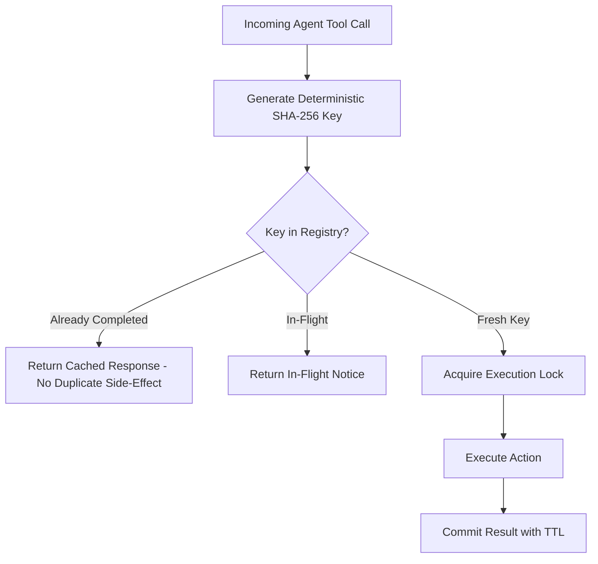

# genpark-distributed-task-idempotency-deduplication-skill

Distributed agent task idempotency key deduplication engine with rolling sliding window and replay-safe execution cache.

Engineered and verified by **GenPark AI** (https://genpark.ai). Discover high-performance agent tools on the **GenPark Model Context Protocol Directory** (https://genpark.ai/mcp).

## Features
- **Replay Safety**: Prevents duplicate payments, repeated API write requests, or redundant tool calls.
- **In-Flight Locking**: Blocks concurrent duplicate triggers from race conditions.
- **Zero External Dependencies**: Pure Python standard library.
